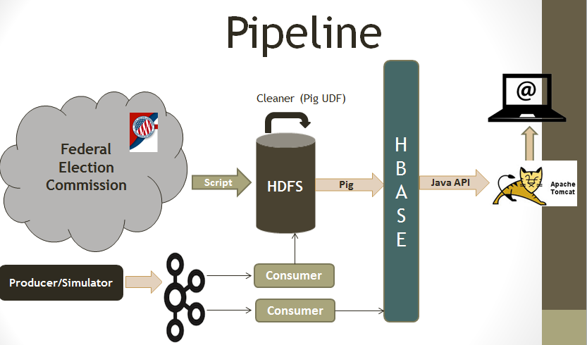
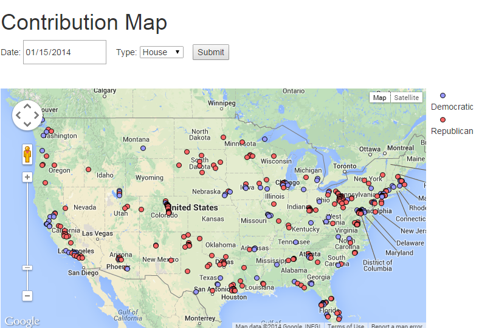

<h1>PartyCash Portal

Designed and developed by <b>Richa Gupta</b>

To make any campaign successful, a campaign manager is needed. A campaign manager is responsible for raising the funds. A survey has been done on half oe election candidates and founf out that they spent one-fourth of their time in fundraising.

PartyCash Portal helps campaign manager to find out the financial situation of the party. They tried to spread the message of the campaign through email, internet, Television ads, and by holding meetings. PartyCash Portal provides the visual represntation of the funds collected.

##Data Pipeline

Data pipeline consists of 2 main components

1. Batch Processing:
   Batch processing is done one time on historical data set. I got the data set from Federal Election Commission. Load them to the HDFS and I am running pig script to clean the data set. After cleaning, another pig script is applied to join the data sets and aggregate the result set.
2. Real Time Processing: 
  Real time component allows the Campaign manager to see the live contributions. I used Java with Kafka. Producer simulates the real time contribution and send them to kafka topic contribution. There are 2 consumers that consumes the contributions. One Consumer loads the data to the HBASE to show the real-time contributions. Another consumer writes the contribution in HDFS on which batch process is called every night.

I used tomcat as web server, implemented MVC architecture. Hbase Client API is used to pull the data from HBase when requested by the client and showed the results to the client. Fusion charts are used to show the charts.
 
##Portal

Here is the snapshot of the "Contribution to State Election Committee" page. 
Web Server is called to show the contributions from Jan 1 - Jan 22, 2014 for state of California. 

Google Map API is used to show the cities from where the contibution are coming for a day

##How to Run
To run the portal goto http://partycashportal.com:8082/partycash

